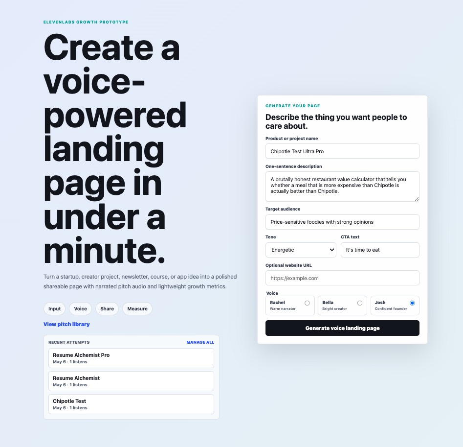
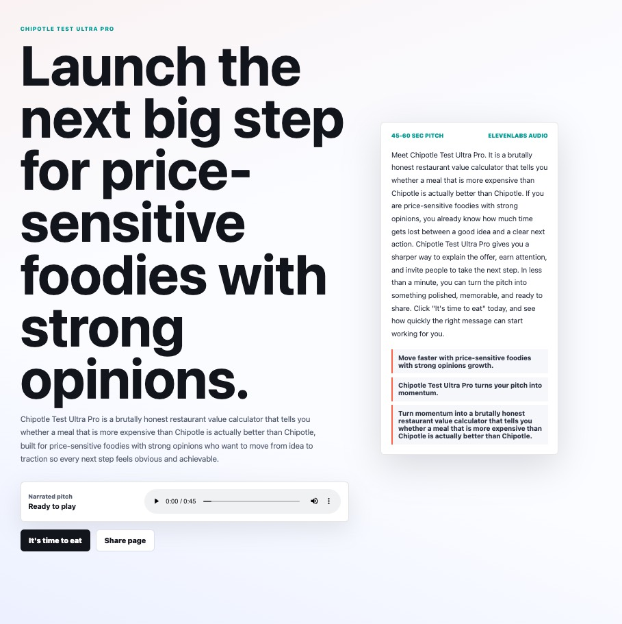
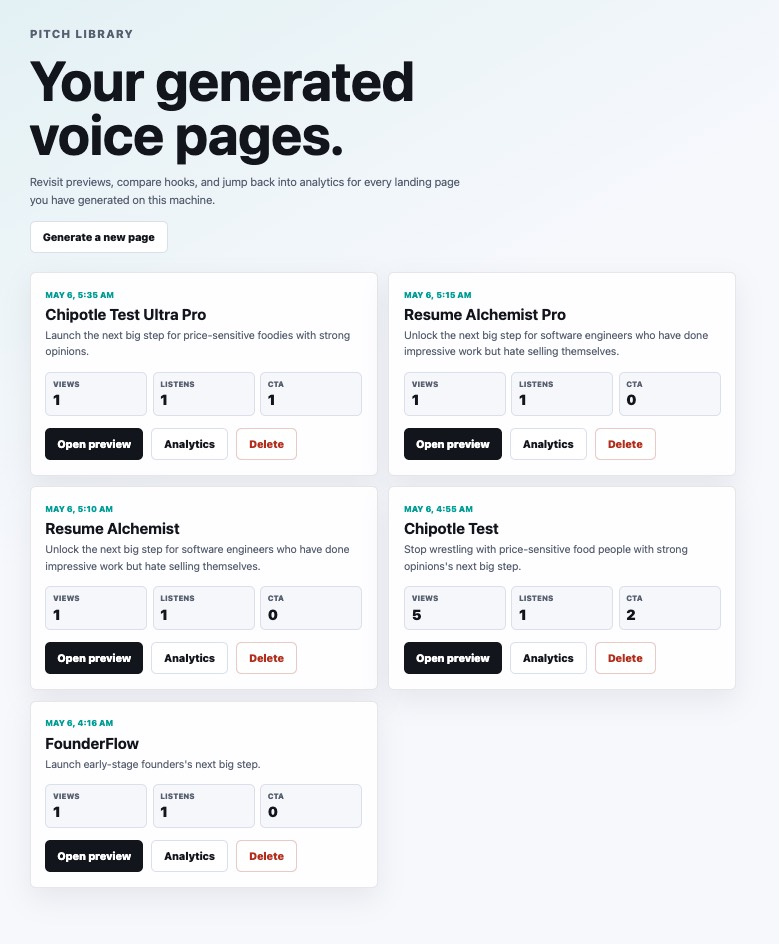

# Voice Landing Page Generator

A product-led growth prototype that turns a project idea into a polished,
shareable landing page with generated marketing copy, an ElevenLabs narrated
voice pitch, a CTA, and lightweight engagement analytics. The goal is to make
the first-minute ElevenLabs activation loop tangible: input an idea, generate a
voice-enhanced artifact, share it, and measure views, listens, shares, and CTA
clicks.

## Demo

### Generator



### Generated preview



[Download the generated preview screen recording](docs/media/chipotle-preview.mp4)

### Pitch library



### Preview detail


## Run locally

```bash
npm install
npm run dev
```

Open `http://localhost:3000`.

## Environment

Create `.env.local`:

```bash
ELEVENLABS_API_KEY=your_api_key_here
```

Without an ElevenLabs key, the app still generates copy and preview pages, and the preview includes a browser speech fallback so the activation flow can be demoed.

## What it demonstrates

- Fast creator/startup input form
- Conversion-oriented landing page copy generation
- ElevenLabs text-to-speech generation with selectable voices
- Shareable preview URLs at `/preview/[id]`
- Lightweight analytics at `/dashboard/[id]`
- Local JSON persistence and cached audio files
